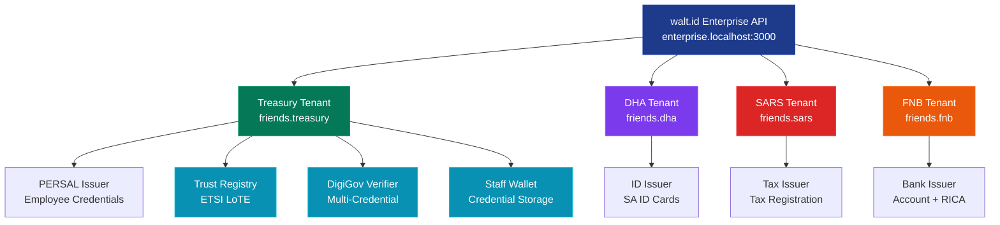
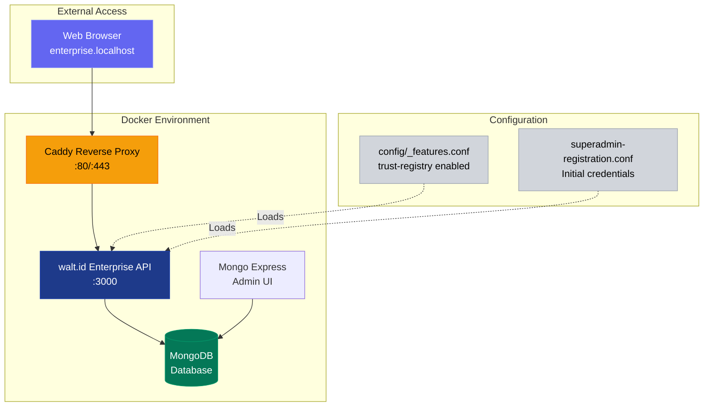
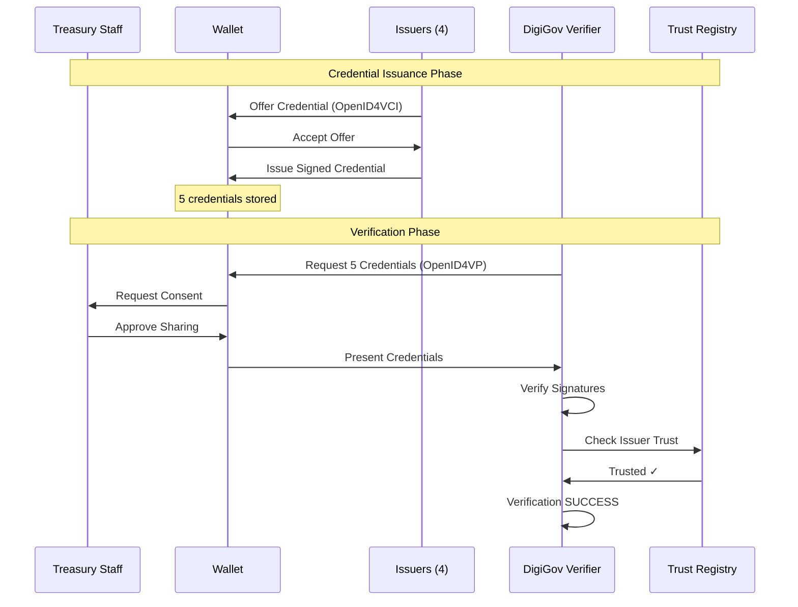

# Friends & Family Distributed Identity POC

**Enterprise SSI Platform with ETSI Trust Registry**

National Treasury Staff Pilot

*May 12, 2026*

---

## Executive Summary

This proof-of-concept demonstrates a complete distributed identity ecosystem for South African government services using Self-Sovereign Identity (SSI) principles.

**Test Group:** National Treasury staff and their families

**Platform:** walt.id Enterprise v1.0.0.260423-SNAPSHOT

**Feature:** ETSI Trust Lists (PR #17)

---

## Key Achievements

<!-- .element: class="fragment" -->
✅ **Multi-Issuer Infrastructure** - 4 government/financial issuers operational

<!-- .element: class="fragment" -->
✅ **ETSI-Compliant Trust Registry** - Enterprise trust list validation

<!-- .element: class="fragment" -->
✅ **Cross-Domain Verification** - Single verifier accepting credentials from multiple authorities

<!-- .element: class="fragment" -->
✅ **Fully Automated Setup** - Clean database, reproducible results

---

## The Problem

Treasury staff and their families must interact with multiple government departments and financial institutions:

<!-- .element: class="fragment" -->
🏛️ **Department of Home Affairs** - Identity verification

<!-- .element: class="fragment" -->
💼 **National Treasury (PERSAL)** - Employment verification

<!-- .element: class="fragment" -->
💰 **SARS** - Tax compliance

<!-- .element: class="fragment" -->
🏦 **Banks (FNB)** - Financial services

<!-- .element: class="fragment" -->
**Current State:** Separate authentication flows, physical documents, manual verification

---

## The Solution

A unified distributed identity platform where:

<!-- .element: class="fragment" -->
**Treasury Staff** hold verifiable credentials from multiple issuers in one wallet

<!-- .element: class="fragment" -->
**Issuers** maintain sovereignty over their credential types

<!-- .element: class="fragment" -->
**Verifiers** can trust credentials from any registered government issuer

<!-- .element: class="fragment" -->
**Trust** is established through ETSI-compliant trust registries

---

## Platform Architecture



---

## Deployment Architecture



---

## POC Use Case: DigiGov Services Portal

A Treasury staff member applies for a government service requiring proof of:

<!-- .element: class="fragment" -->
1. **Employment** (National Treasury PERSAL)

<!-- .element: class="fragment" -->
2. **Identity** (Department of Home Affairs)

<!-- .element: class="fragment" -->
3. **Tax Status** (SARS)

<!-- .element: class="fragment" -->
4. **Banking** (FNB - FICA compliance)

<!-- .element: class="fragment" -->
5. **SIM Registration** (FNB - RICA verification)

----

## Credential Flow



----

## Before vs After

<!-- .element: class="fragment" -->
**Traditional Process:** 5 separate authentication flows, physical documents, manual verification

<!-- .element: class="fragment" -->
**SSI Process:** 1-click consent, instant verification, cryptographic proof

---

## Infrastructure Overview

| Component            | Count | Purpose                                     |
| -------------------- | ----- | ------------------------------------------- |
| **Organizations**    | 1     | Root organizational unit (`friends`)        |
| **Tenants**          | 4     | Separate domains for each issuer            |
| **Issuers**          | 4     | Credential-issuing authorities              |
| **Credential Types** | 5     | Different credential schemas                |
| **Trust Registry**   | 1     | ETSI-compliant trust list                   |
| **Verifier**         | 1     | Multi-credential verification service       |
| **Wallet**           | 1     | Treasury staff credential storage (POC)     |

---

## Journey Test: System Initialization

**Step 1: Create Superadmin**

```bash
npx tsx e2e/journey-sa-gov.ts --init-system
```

<!-- .element: class="fragment" -->
Creates `superadmin@walt.id` with admin privileges

<!-- .element: class="fragment" -->
One-time setup for platform

<!-- .element: class="fragment" -->
**Result:** ✅ Superadmin created and authenticated

----

## Journey Test: System Initialization

**Step 2: Create Organization**

<!-- .element: class="fragment" -->
Organization: `friends`

<!-- .element: class="fragment" -->
Domain: `friends.enterprise.localhost`

<!-- .element: class="fragment" -->
User: `user@walt.id`

<!-- .element: class="fragment" -->
**Result:** ✅ Organization created with base tenant

---

## Journey Test: Infrastructure Setup

**Step 3: Login as Organization User**

<!-- .element: class="fragment" -->
User: `user@walt.id`

<!-- .element: class="fragment" -->
Password: `user123456`

<!-- .element: class="fragment" -->
**Result:** ✅ User authenticated, token obtained

----

## Journey Test: Infrastructure Setup

**Step 4: Create Treasury Tenant**

<!-- .element: class="fragment" -->
Tenant: `friends.treasury`

<!-- .element: class="fragment" -->
Name: "National Treasury"

<!-- .element: class="fragment" -->
**Result:** ✅ Treasury tenant operational

----

## Journey Test: Infrastructure Setup

**Step 5: Create DHA Tenant**

<!-- .element: class="fragment" -->
Tenant: `friends.dha`

<!-- .element: class="fragment" -->
Name: "Department of Home Affairs"

<!-- .element: class="fragment" -->
**Result:** ✅ DHA tenant operational

----

## Journey Test: Infrastructure Setup

**Step 6: Create SARS Tenant**

<!-- .element: class="fragment" -->
Tenant: `friends.sars`

<!-- .element: class="fragment" -->
Name: "South African Revenue Service"

<!-- .element: class="fragment" -->
**Result:** ✅ SARS tenant operational

----

## Journey Test: Infrastructure Setup

**Step 7: Create FNB Tenant**

<!-- .element: class="fragment" -->
Tenant: `friends.fnb`

<!-- .element: class="fragment" -->
Name: "First National Bank"

<!-- .element: class="fragment" -->
**Result:** ✅ FNB tenant operational

---

## Journey Test: Core Services

**Step 8: Create Staff Wallet**

<!-- .element: class="fragment" -->
Type: `web-wallet`

<!-- .element: class="fragment" -->
Path: `friends.treasury.wallet`

<!-- .element: class="fragment" -->
**Result:** ✅ Wallet service created for credential storage

----

## Journey Test: Core Services

**Step 9: Create Key Management Service**

<!-- .element: class="fragment" -->
Type: `kms`

<!-- .element: class="fragment" -->
Path: `friends.treasury.kms`

<!-- .element: class="fragment" -->
Backend: `jwk`

<!-- .element: class="fragment" -->
**Result:** ✅ KMS created for cryptographic operations

----

## Journey Test: Core Services

**Step 10: Create ETSI Trust Registry**

<!-- .element: class="fragment" -->
Type: `trust-registry`

<!-- .element: class="fragment" -->
Path: `friends.treasury.trustregistry`

<!-- .element: class="fragment" -->
Format: ETSI LoTE (List of Trusted Entities)

<!-- .element: class="fragment" -->
**Result:** ✅ Trust registry operational

----

## Journey Test: Core Services

**Step 11: Create DigiGov Verifier**

<!-- .element: class="fragment" -->
Type: `verifier2`

<!-- .element: class="fragment" -->
Path: `friends.treasury.digigov`

<!-- .element: class="fragment" -->
Client ID: `digigov-verifier`

<!-- .element: class="fragment" -->
Trust Registry: `friends.treasury.trustregistry`

<!-- .element: class="fragment" -->
**Result:** ✅ Verifier linked to trust registry

---

## Journey Test: Credential Issuers

**Step 12: Create PERSAL Issuer (Treasury)**

<!-- .element: class="fragment" -->
Issuer: `friends.treasury.persal`

<!-- .element: class="fragment" -->
Credential: `EmployeeStatusCredential`

<!-- .element: class="fragment" -->
Signing Key: `persal-signing-key` (secp256r1)

<!-- .element: class="fragment" -->
Format: `jwt_vc_json`

<!-- .element: class="fragment" -->
**Result:** ✅ PERSAL issuer ready to issue employee credentials

----

## Journey Test: Credential Issuers

**Step 13: Create DHA Issuer**

<!-- .element: class="fragment" -->
Issuer: `friends.dha.dha-issuer`

<!-- .element: class="fragment" -->
Credential: `SouthAfricanIDCredential`

<!-- .element: class="fragment" -->
Signing Key: `dha-signing-key` (secp256r1)

<!-- .element: class="fragment" -->
**Result:** ✅ DHA issuer ready to issue SA ID credentials

----

## Journey Test: Credential Issuers

**Step 14: Create SARS Issuer**

<!-- .element: class="fragment" -->
Issuer: `friends.sars.sars-issuer`

<!-- .element: class="fragment" -->
Credential: `TaxRegistrationCredential`

<!-- .element: class="fragment" -->
Signing Key: `sars-signing-key` (secp256r1)

<!-- .element: class="fragment" -->
**Result:** ✅ SARS issuer ready to issue tax credentials

----

## Journey Test: Credential Issuers

**Step 15: Create FNB Issuer**

<!-- .element: class="fragment" -->
Issuer: `friends.fnb.fnb-issuer`

<!-- .element: class="fragment" -->
Credentials: `BankAccountCredential`, `RICACredential`

<!-- .element: class="fragment" -->
Signing Key: `fnb-signing-key` (secp256r1)

<!-- .element: class="fragment" -->
**Result:** ✅ FNB issuer ready to issue bank + RICA credentials

---

## Journey Test: Trust Registry Setup

**Step 16: Load ETSI Trust Source**

```json
{
  "trustListName": "SA Government Issuers",
  "format": "LoTE",
  "status": "active",
  "territory": "ZA"
}
```

<!-- .element: class="fragment" -->
**Entities:** National Treasury (PERSAL), Department of Home Affairs, South African Revenue Service, First National Bank

<!-- .element: class="fragment" -->
**Result:** ✅ Trust source loaded with 4 entities, 4 services, 4 identities

---

## Journey Test: Credential Profiles

**Step 17: Create Employee Profile**

```json
{
  "id": "staff-001",
  "credentialData": {
    "credentialSubject": {
      "employeeId": "EMP2024001",
      "department": "National Treasury",
      "position": "Senior Economist",
      "status": "active"
    }
  }
}
```

<!-- .element: class="fragment" -->
**Result:** ✅ Employee profile created

----

## Journey Test: Credential Profiles

**Step 18: Create SA ID Profile**

```json
{
  "credentialSubject": {
    "idNumber": "8501015800080",
    "firstName": "John",
    "lastName": "Doe",
    "dateOfBirth": "1985-01-01",
    "nationality": "South African"
  }
}
```

<!-- .element: class="fragment" -->
**Result:** ✅ SA ID profile created

----

## Journey Test: Credential Profiles

**Step 19: Create Tax Registration Profile**

```json
{
  "credentialSubject": {
    "taxNumber": "1234567890",
    "registrationDate": "2010-01-15",
    "status": "compliant"
  }
}
```

<!-- .element: class="fragment" -->
**Result:** ✅ Tax registration profile created

----

## Journey Test: Credential Profiles

**Step 20: Create Bank Account Profile**

```json
{
  "credentialSubject": {
    "accountNumber": "62123456789",
    "accountType": "Savings",
    "status": "active",
    "ficaStatus": "verified"
  }
}
```

<!-- .element: class="fragment" -->
**Result:** ✅ Bank account profile created

----

## Journey Test: Credential Profiles

**Step 21: Create RICA Profile**

```json
{
  "credentialSubject": {
    "msisdn": "+27821234567",
    "registrationDate": "2023-06-15",
    "status": "verified",
    "provider": "Vodacom"
  }
}
```

<!-- .element: class="fragment" -->
**Result:** ✅ RICA profile created

---

## Journey Test: Credential Issuance

**Step 22: Issue Employee Credential**

<!-- .element: class="fragment" -->
Issuer: `friends.treasury.persal`

<!-- .element: class="fragment" -->
Profile: `staff-001`

<!-- .element: class="fragment" -->
Offer URL generated

<!-- .element: class="fragment" -->
**Result:** ✅ Employee credential offer created

----

## Journey Test: Credential Issuance

**Step 23: Issue SA ID Credential**

<!-- .element: class="fragment" -->
Issuer: `friends.dha.dha-issuer`

<!-- .element: class="fragment" -->
Offer URL generated

<!-- .element: class="fragment" -->
**Result:** ✅ SA ID credential offer created

----

## Journey Test: Credential Issuance

**Step 24: Issue Tax Credential**

<!-- .element: class="fragment" -->
Issuer: `friends.sars.sars-issuer`

<!-- .element: class="fragment" -->
Offer URL generated

<!-- .element: class="fragment" -->
**Result:** ✅ Tax credential offer created

----

## Journey Test: Credential Issuance

**Step 25: Issue Bank Account Credential**

<!-- .element: class="fragment" -->
Issuer: `friends.fnb.fnb-issuer`

<!-- .element: class="fragment" -->
Offer URL generated

<!-- .element: class="fragment" -->
**Result:** ✅ Bank account credential offer created

----

## Journey Test: Credential Issuance

**Step 26: Issue RICA Credential**

<!-- .element: class="fragment" -->
Issuer: `friends.fnb.fnb-issuer`

<!-- .element: class="fragment" -->
Offer URL generated

<!-- .element: class="fragment" -->
**Result:** ✅ RICA credential offer created

---

## Journey Test: Verification

**Step 27: Create Verification Session**

<!-- .element: class="fragment" -->
**Requested Credentials:** EmployeeStatusCredential, SouthAfricanIDCredential, TaxRegistrationCredential, BankAccountCredential, RICACredential

<!-- .element: class="fragment" -->
**Verification Policies:** Signature validation, ETSI trust list validation

<!-- .element: class="fragment" -->
**Result:** ✅ Verification session created with OpenID4VP request

---

## Test Results Summary

**Total Steps:** 27

<!-- .element: class="fragment" -->
**Infrastructure:** 11 steps - Organization setup, 4 tenants created, Core services operational

<!-- .element: class="fragment" -->
**Issuers:** 4 steps - 4 issuers configured, 5 credential types supported

<!-- .element: class="fragment" -->
**Credentials:** 10 steps - 5 profiles created, 5 credential offers generated

<!-- .element: class="fragment" -->
**Trust & Verification:** 2 steps - ETSI trust registry loaded, Multi-credential verification session created

---

## Trust Registry Details

**Format:** ETSI LoTE (List of Trusted Entities)

**Territory:** ZA (South Africa)

**Entities Registered:** 4

| Entity | Services | Identity Type |
|--------|----------|---------------|
| National Treasury | PERSAL Issuer | DID |
| DHA | ID Issuer | DID |
| SARS | Tax Issuer | DID |
| FNB | Bank Issuer | DID |

<!-- .element: class="fragment" -->
**Total Trust Anchors:** 4 DIDs

---

## Credential Offers Generated

All offers use OpenID4VCI protocol:

```
openid-credential-offer://?credential_offer_uri=
  http://friends.enterprise.localhost/v2/
  {issuer-path}/issuer-service-api/
  openid4vci/credential-offer?id={uuid}
```

<!-- .element: class="fragment" -->
**Test Artifacts Saved:** `journey-sa-gov-2026-05-12T05-57-38/` with all JSON responses, trust registry sources, offers

---

## Verification Request

**Protocol:** OpenID4VP

```
openid4vp://authorize?
  client_id=digigov-verifier&
  request_uri=http://friends.enterprise.localhost/
    v1/friends.treasury.digigov/verifier2-service-api/
    {session-id}/request
```

<!-- .element: class="fragment" -->
**Policies Applied:** 1) Signature validation (cryptographic proof), 2) ETSI trust list validation (issuer trusted?)

---

## Business Value Delivered

<!-- .element: class="fragment" -->
**For Treasury Staff:** One wallet for all government credentials, Privacy-preserving credential sharing, Instant verification (no waiting)

<!-- .element: class="fragment" -->
**For Government Departments:** Reduced fraud, Lower operational costs, Interoperability between departments

<!-- .element: class="fragment" -->
**For Verifiers:** Instant cryptographic verification, Trust registry validation, No central database dependency

---

## Key Metrics

**Infrastructure:**
- 1 Organization
- 4 Tenants
- 4 Issuers
- 1 Verifier
- 1 Trust Registry

<!-- .element: class="fragment" -->
**Credentials:** 5 Credential types, 5 Credential offers, 1 Verification session

<!-- .element: class="fragment" -->
**Automation:** 100% automated setup, Clean database reproducibility, Single command execution

---

## Technical Standards

<!-- .element: class="fragment" -->
**Protocols:** OpenID4VCI (credential issuance), OpenID4VP (credential presentation), W3C Verifiable Credentials

<!-- .element: class="fragment" -->
**Trust Framework:** ETSI LoTE (List of Trusted Entities), DID-based identity

<!-- .element: class="fragment" -->
**Cryptography:** secp256r1 (ES256) signing, JWT VC format

---

## Reproduction Steps

**Clean Environment Setup:**

```bash
# 1. Clean database
docker-compose down -v

# 2. Enable trust-registry feature
# Edit config/_features.conf

# 3. Start services
docker-compose up -d && sleep 15

# 4. Initialize system
npx tsx e2e/journey-sa-gov.ts --init-system

# 5. Run journey with ETSI trust list
npx tsx e2e/journey-sa-gov.ts --etsi-trust-list
```

<!-- .element: class="fragment" -->
**Result:** Full POC infrastructure deployed in ~2 minutes

---

## Next Steps

<!-- .element: class="fragment" -->
**Phase 1: Feature Branch Validation (Current)** - Infrastructure automated ✅, Wallet acceptance testing 🔄, End-to-end verification testing 🔄

<!-- .element: class="fragment" -->
**Phase 2: walt.id Production Release** - Continue engagement with walt.id as ETSI Trust Registry features move from feature branch to production release

<!-- .element: class="fragment" -->
**Phase 3: Internal K8s Deployment** - Deploy POC on internal Kubernetes infrastructure with production-ready walt.id version, HTTPS/TLS configuration, Internal network access only

<!-- .element: class="fragment" -->
**Phase 4: Pilot Expansion** - Onboard 50 Treasury staff, Real credential issuance, User feedback collection

<!-- .element: class="fragment" -->
**Phase 5: Production Readiness** - Security audit, Performance testing, Compliance certification

---

## Documentation

**Available Resources:**

- 📄 **Progress Report** - Technical walkthrough with diagrams
- 📘 **Quick Start Guide** - Step-by-step reproduction
- 🧪 **Test Artifacts** - `journey-sa-gov-2026-05-12T05-57-38/`
- 💻 **Source Code** - `e2e/journey-sa-gov.ts`

<!-- .element: class="fragment" -->
**Platform Documentation:** walt.id Enterprise docs, ETSI Trust Lists specification, OpenID4VC protocols

---

## POC Status

**Status:** ✅ POC Architecture Validated on Feature Branch

<!-- .element: class="fragment" -->
**Current Environment:** Docker Compose, HTTP (localhost), Feature branch `feature/wal-903-etsi-trust-lists`

<!-- .element: class="fragment" -->
**Readiness:** Infrastructure fully automated, Trust Registry ETSI-compliant, Multi-issuer with 4 issuers tested, Reproducible setup validated

<!-- .element: class="fragment" -->
**Recommendation:** Continue walt.id engagement for production release, then deploy on internal K8s infrastructure for pilot with Treasury staff and families

---

## Questions?

**Test Run Reference:** `journey-sa-gov-2026-05-12T05-57-38`

**Platform:** walt.id Enterprise v1.0.0.260423-SNAPSHOT

**Feature Branch:** `feature/wal-903-etsi-trust-lists`

**Contact:** Friends & Family POC Team

---

# Thank You

**Friends & Family Distributed Identity POC**

*Building the future of government services*

*May 12, 2026*
